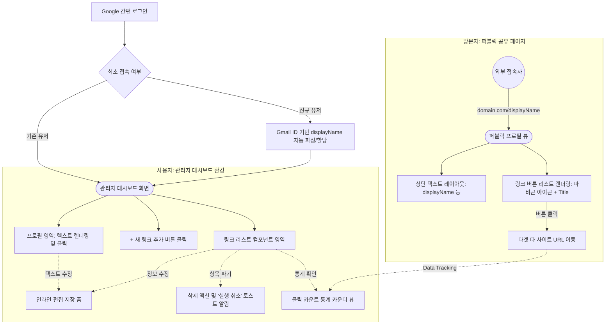

# 마이링크 와이어프레임 및 화면 구조 (Wireframe)

본 문서는 `마이링크` 서비스의 시각적인 레이아웃 배치, 페이지 뷰 형태, 시스템 컴포넌트 간 반응 흐름을 마크다운, 머메이드(Mermaid) 차트, 그리고 ASCII 아트를 활용하여 표현한 설계서입니다.

---

## 1. 전역 컴포넌트 플로우 (Component System Flow)
로그인부터 관리자 대시보드 조작, 방문자의 이동 및 클릭 통계가 맞물려 돌아가는 전체 화면 흐름을 시각화합니다.



---

## 2. 디테일 화면 설계 (ASCII Art Wireframe)

`shadcn/ui`의 단정하고 직관적인 스타일을 반영한 가장 핵심이 되는 두 가지 화면(대시보드와 퍼블릭 뷰)의 모바일 최우선(Mobile-first) 아키텍처 배치도입니다.

### 2.1 관리자 대시보드 (Dashboard View)
소유자가 로그인하여 자신의 프로필과 링크를 즉석에서 인라인으로 편집하며, 각 링크별로 달성한 클릭 통계를 구경하는 메인 화면 레이아웃입니다.

```text
+-------------------------------------------------------------+
|  [ 마이링크 심벌 로고 ]                               [로그아웃] |
+-------------------------------------------------------------+
|                                                             |
|   ✏️ [ displayName ]  < (해당 텍스트들을 툭 누르면 인라인 입력 폼 변신) |
|   ✏️ [ username ]                                            |
|   ✏️ [ Bio: 이곳을 눌러 본인을 자유롭게 소개해주세요. ]               |
|                                                             |
|   +-----------------------------------------------------+   |
|   |  + 새 링크 추가                                        |   |
|   +-----------------------------------------------------+   |
|                                                             |
|   [ 등록된 링크 리스트 목록 ]                                    |
|                                                             |
|   +-----------------------------------------------------+   |
|   | {파비콘}   ✏️ 제목: 내 기술 블로그                     |   |
|   |            ✏️ URL: https://tech.blog.com              |   |
|   |                                                     |   |
|   |                   📊 142 clicks         [🗑️ 삭제]    |   |
|   +-----------------------------------------------------+   |
|                                                             |
|   +-----------------------------------------------------+   |
|   | {파비콘}   ✏️ 제목: GitHub 오픈소스 저장소             |   |
|   |            ✏️ URL: https://github.com/my-repo         |   |
|   |                                                     |   |
|   |                   📊 34 clicks          [🗑️ 삭제]    |   |
|   +-----------------------------------------------------+   |
|                                                             |
|  ( 🗑️ 삭제 클릭 시 즉시 지워지며 화면 하단 5초간 플로팅 팝업 )          |
|  [ ✓ 1개의 링크가 삭제되었습니다.           (실행 취소) ]           |
+-------------------------------------------------------------+
```

---

### 2.2 퍼블릭 공유 페이지 (Public View)
외부 방문자가 공유된 주소(`domain.com/displayName`)를 클릭했을 때 마주하게 되는 완전히 덜어낸 모바일 환경입니다.

```text
+-------------------------------------------------------------+
|                                                             |
|                                                             |
|         (( 거대한 굵은 폰트의 극단적 미니멀리즘 ))                 |
|                        displayName                          |
|                                                             |
|                          username                           |
|       Bio: 안녕하세요, 디자인에 미친 개발자입니다!                  |
|                                                             |
|                                                             |
|   +-----------------------------------------------------+   |
|   |                                                     |   |
|   |  {파비콘}                 내 기술 블로그                |   |
|   |                                                     |   |
|   +-----------------------------------------------------+   |
|                                                             |
|   +-----------------------------------------------------+   |
|   |                                                     |   |
|   |  {파비콘}              GitHub 오픈소스 저장소           |   |
|   |                                                     |   |
|   +-----------------------------------------------------+   |
|                                                             |
|                                                             |
|                                                             |
+-------------------------------------------------------------+
```
